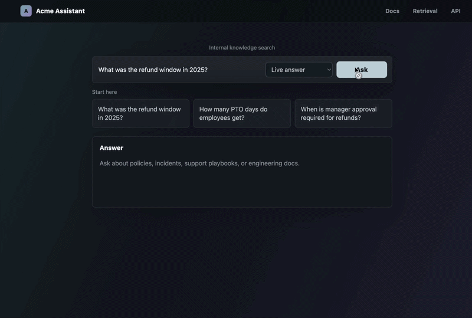
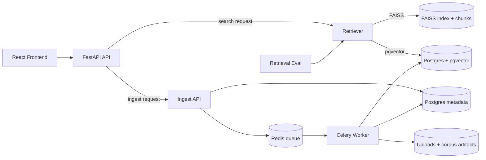

# RAG Internal Docs Assistant


A Retrieval-Augmented Generation (RAG) system that answers questions using internal company documents across engineering, support, HR, and operations.

Designed to simulate a production internal knowledge assistant with versioned documents, mixed formats (Markdown + PDF), and evaluation-driven development.



## Project Highlights

- Postgres/pgvector retrieval with FAISS fallback and a one-command local switch.
- Async ingestion with Redis + Celery for mounted docs and uploaded files.
- Eval-gated retriever parity against a committed FAISS baseline.
- Admin UI for uploads, ingest jobs, documents, search history, and corpus health.
- Docker dev and production-like profiles for consistent local and deployment-style runs.
- Backend and frontend tests for upload, ingest, retrieval, and admin workflows.

## Architecture



## Results

- Achieved parity with the committed FAISS baseline on the retrieval eval gate
- Current retrieval metrics: `MRR = 1.000`, `Top-1 accuracy = 1.000`
- Admin UI surfaces live corpus, ingestion, and usage metrics

## Retry and Idempotency

If the same ingest runs more than once, the corpus should not end up with
duplicate documents.

- each upload and ingest job is recorded in Postgres
- unchanged documents are skipped
- if a document changes, the old active version is marked inactive and the new
  version becomes active
- the original upload and job history stays available for debugging

These two tables do different jobs:

- `uploaded_files` = the file we received
- `source_documents` = the searchable document version we created from it

That is why the upload can stay in history even when a new document version
replaces the old active one.

That keeps re-runs safe and makes the corpus easier to trust. In a larger cloud
setup, I would put retry/backoff rules in the workflow or queue layer and send
jobs that keep failing into a dead-letter path. In practice, that means the
queue or workflow retries a job a few times with backoff, and if it still
fails, the message is moved aside for later inspection instead of blocking the
main queue.

---

## Development setup

- Install Docker Desktop.
- Copy `.env.example` to `.env` and set values when running LLM-backed commands.
- Build the app images: `make install`
- Run tests from the repo root: `make test`

For local non-Docker debugging, use the `local-*` Makefile targets.

```bash
make local-backend
make local-frontend
make local-test
```

The default Makefile targets use Docker.

### Switching the retriever locally

The app can read from either FAISS or Postgres/pgvector. Switch it with:

```bash
make retriever-faiss
make retriever-postgres
```

These commands update `RETRIEVER_BACKEND` in `.env` and restart the API and
worker containers so the new retriever takes effect right away. `make
retriever-postgres` also checks whether the active Postgres corpus is empty by
default, and if it is, it runs the mounted-document ingest pipeline for you.

Use `faiss` if you want the original file-based retriever. Use `postgres` if
you want the database-backed retriever that reads from `source_documents` and
`document_chunks`.

For quality checks, the Postgres path is the one exercised by `make docker-eval`.
The FAISS path remains the fallback and the baseline reference point.

### Production-like Docker profile

When you want the stack to behave more like a deployment and less like a live
development workspace, use the production-like Compose profile:

```bash
make docker-prod-up
make docker-prod-logs
make docker-prod-down
```

This profile:

- runs the API and worker without reload
- serves the frontend from built assets instead of the Vite dev server
- avoids bind-mounting the repo source into the runtime containers
- keeps persistent Docker volumes for uploads and corpus artifacts in the local
  demo
- defaults the retriever to Postgres unless you override `RETRIEVER_BACKEND`

The frontend is published on `http://localhost:4173` in this profile.
Use `make docker-prod-test` to validate the Compose configuration before
starting it.

Before shipping to production, I would also add authentication and
authorization so the admin pages and ingest endpoints are not open by default.
In practice, that usually means SSO or OIDC for people, plus role checks for
admin actions.

For a real deployment, the same containers can run on ECS/Fargate or Cloud Run.
In that setup, I would run migrations as a release step or one-off job before
the API starts serving traffic, and I would store uploads in object storage
instead of local Docker volumes.

- upload storage: Amazon S3, Google Cloud Storage, or Cloudflare R2
- database: Postgres for metadata, job state, and document indexes
- app runtime: ECS/Fargate or Cloud Run for the API and worker services

---

## Local Demo

Run the Dockerized app:

```bash
make dev
```

Open `http://localhost:5173` and try:

- "What was the refund window in 2025?"
- "How many PTO days do employees get?"
- "When is manager approval required for refunds?"

The local demo includes:

- API
- frontend
- Postgres with pgvector
- Redis
- Celery worker

The UI supports live generation, mock safe mode, and retrieval-only inspection.
Mock mode is useful for demos when Groq quota is unavailable.

Useful Docker commands:

```bash
make logs-backend
make logs-frontend
make test
make stop
```

The dev compose stack bind-mounts the repo, including `data/` and `artifacts/`,
so it uses the same FAISS index and chunk files as local development.

### LangSmith Observability

Set `LANGSMITH_API_KEY` to enable traces for backend chat and retrieval requests. The app defaults to the `acme-company-assistant-dev` project unless `LANGSMITH_PROJECT` is set.

Each trace captures:

- request mode, question length, and requested `final_k`
- retrieval latency, detected year, source count, unique source count, and source metadata
- generation metadata including context size, document count, and source files
- final mode used, answer length, warnings, and end-to-end latency

These fields are intended to support later LangSmith datasets and evaluators for correctness, groundedness, relevance, and retrieval relevance.

---

## What This Project Demonstrates

- Production-oriented RAG architecture with API, worker, queue, and database
- Async ingestion and job lifecycle design
- Retrieval evaluation with MRR and top-1 accuracy
- Handling versioned documents and duplicate sources
- A clear path from local containers to cloud deployment

## Current Limitations

- No authentication or multi-tenant isolation yet
- Local file storage is still used in the demo
- The search stack is designed for moderate scale, not huge corpus sizes
- Autoscaling is not part of the local demo environment

The deeper architecture, ingestion, evaluation, and production notes live in
[docs/architecture.md](docs/architecture.md),
[docs/ingestion.md](docs/ingestion.md),
[docs/evaluation.md](docs/evaluation.md), and
[docs/production.md](docs/production.md).

---

## Production & Scaling

See [docs/production.md](docs/production.md) for the full deployment and scaling
story.

Highlights:

- queue-based ingestion with retries and dead-letter handling
- worker scaling and job status tracking
- splitting keyword and vector search when Postgres becomes the bottleneck
- OpenTelemetry-based observability

---

## Evaluation Story

The detailed evaluation write-up lives in [docs/evaluation.md](docs/evaluation.md).

Short version:

- hybrid retrieval improved once dense and keyword results were merged with
  RRF
- canonical document grouping reduced near-duplicate noise
- a single-year metadata filter fixed the version/year failure mode
- the current `hybrid_rerank` gate reaches 1.000 MRR and 1.000 top-1 accuracy

## Learn More

- [Architecture](docs/architecture.md)
- [Ingestion & Idempotency](docs/ingestion.md)
- [Evaluation Details](docs/evaluation.md)
- [Production & Scaling](docs/production.md)

---
